# Arquitectura de Seguridad del Sistema RUND
## Escuela Superior de Administración Pública (ESAP)

**Versión:** 1.0  
**Fecha:** 27 de noviembre de 2025  
**Clasificación:** Confidencial - Uso Interno  
**Ambiente documentado:** UAT (Pruebas de Aceptación de Usuario)  
**Autor:** Dirección de Entornos y Servicios Virtuales (DESV)

---

## Tabla de Contenidos

1. [Resumen Ejecutivo](#1-resumen-ejecutivo)
2. [Diagrama de Contexto (C4 - Nivel 1)](#2-diagrama-de-contexto-c4---nivel-1)
3. [Diagrama de Contenedores (C4 - Nivel 2)](#3-diagrama-de-contenedores-c4---nivel-2)
4. [Diagrama de Red e Infraestructura](#4-diagrama-de-red-e-infraestructura)
5. [Diagrama de Flujo de Datos (DFD)](#5-diagrama-de-flujo-de-datos-dfd)
6. [Flujo de Autenticación](#6-flujo-de-autenticación)
7. [Matriz de Comunicaciones](#7-matriz-de-comunicaciones)
8. [Inventario de Componentes](#8-inventario-de-componentes)
9. [Consideraciones de Seguridad](#9-consideraciones-de-seguridad)
10. [Anexos](#10-anexos)

---

## 1. Resumen Ejecutivo

### 1.1 Descripción del Sistema

RUND (Registro Único Nacional Docente) es un sistema de gestión documental para la administración de hojas de vida académicas de los profesores de la ESAP. El sistema permite:

- Almacenamiento y gestión de documentos académicos
- Generación de certificados laborales
- Consulta de información profesoral
- Procesamiento inteligente de documentos (OCR e IA)

### 1.2 Componentes del Ecosistema

| Categoría | Componentes | Estado |
|-----------|-------------|--------|
| **Funcionales (Producción)** | RUND-CORE, RUND-API, RUND-MGP, RUND-AUTH | Activos |
| **Experimentales** | RUND-AI, RUND-OCR, RUND-OLLAMA | En desarrollo |
| **Descontinuados** | RUND-PTA | Transferido a OTIC |

### 1.3 Infraestructura

- **Tipo:** On-premise (Centro de datos ESAP)
- **Servidor UAT:** 172.16.234.52
- **Acceso:** Solo red interna ESAP o VPN institucional
- **Containerización:** Docker con red bridge interna

### 1.4 Datos Sensibles Manejados

- Números de cédula de ciudadanía
- Nombres completos de profesores
- Información laboral y académica
- Hojas de vida académicas
- Documentos de soporte (futuro)

---

## 2. Diagrama de Contexto (C4 - Nivel 1)

Este diagrama muestra el sistema RUND y sus interacciones con actores externos.

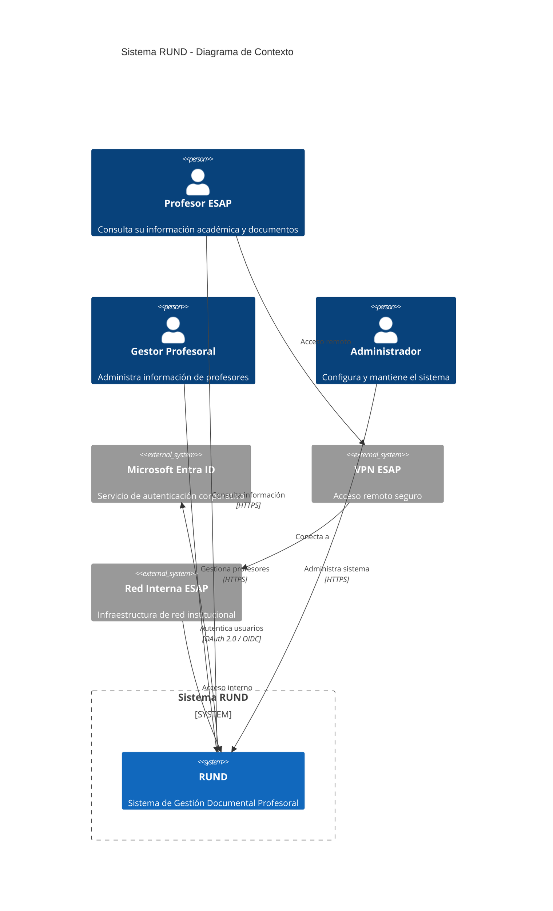

### Diagrama de Contexto (Versión Alternativa - Flujo)

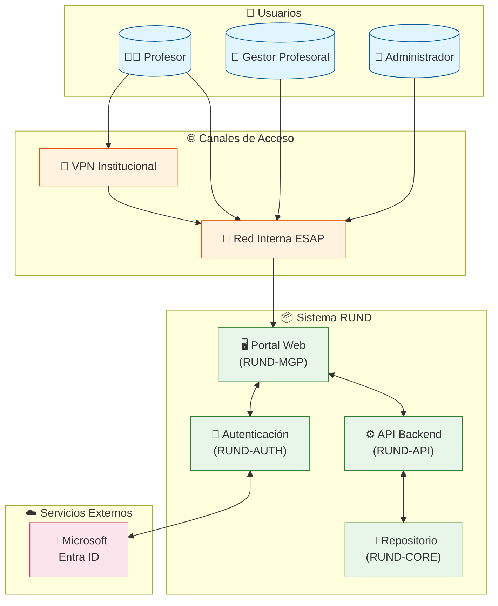

---

## 3. Diagrama de Contenedores (C4 - Nivel 2)

Este diagrama detalla los contenedores Docker que componen el sistema RUND.

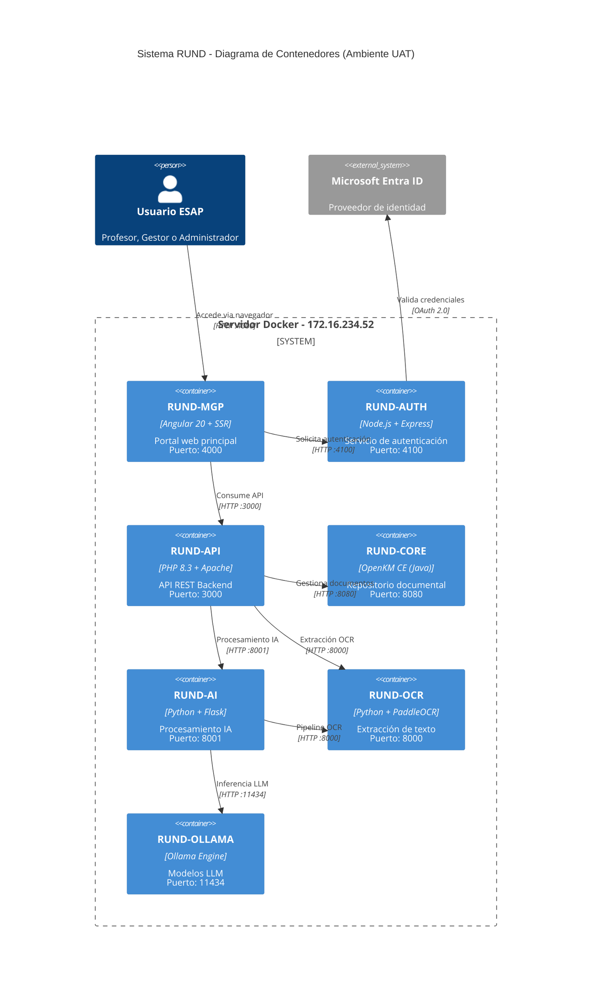

### Diagrama de Contenedores (Versión Detallada)

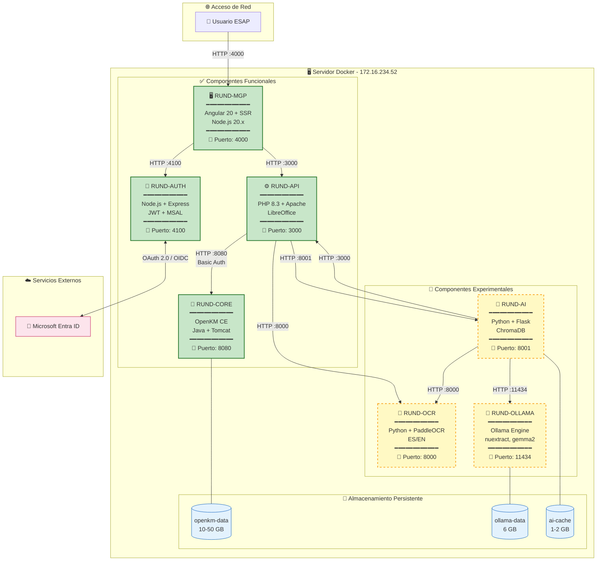

---

## 4. Diagrama de Red e Infraestructura

### 4.1 Topología de Red

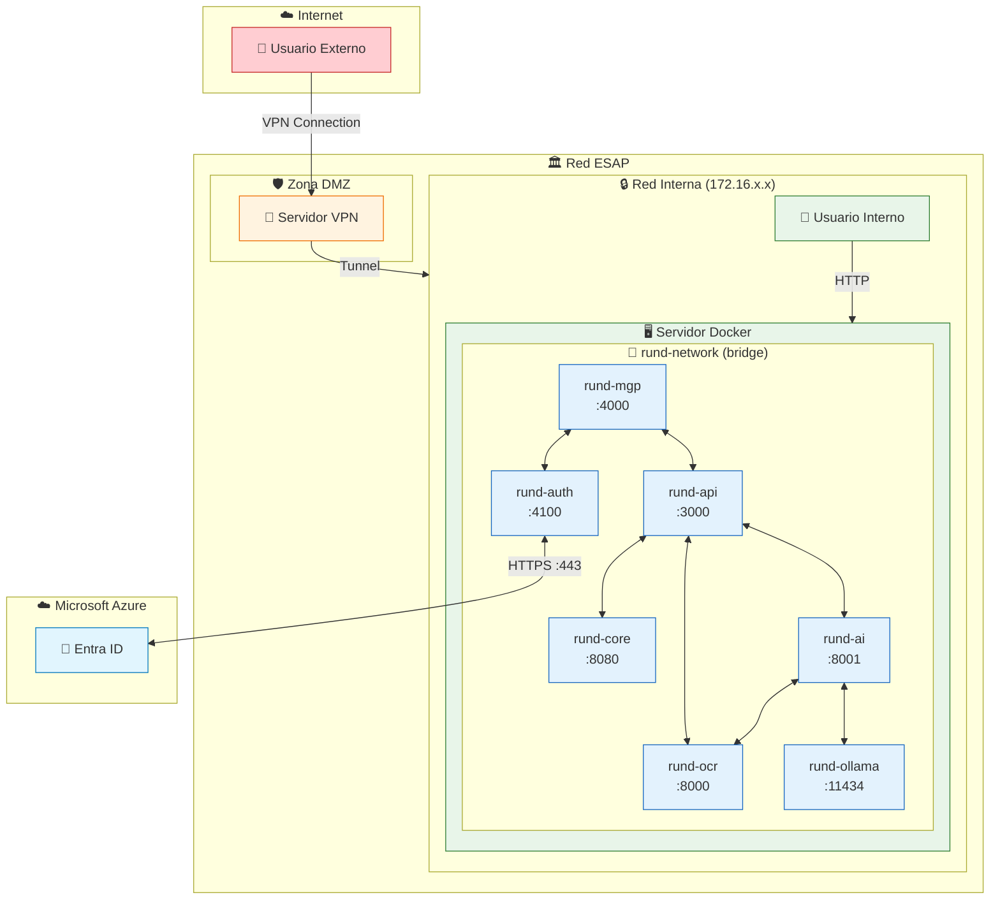

### 4.2 Puertos y Protocolos

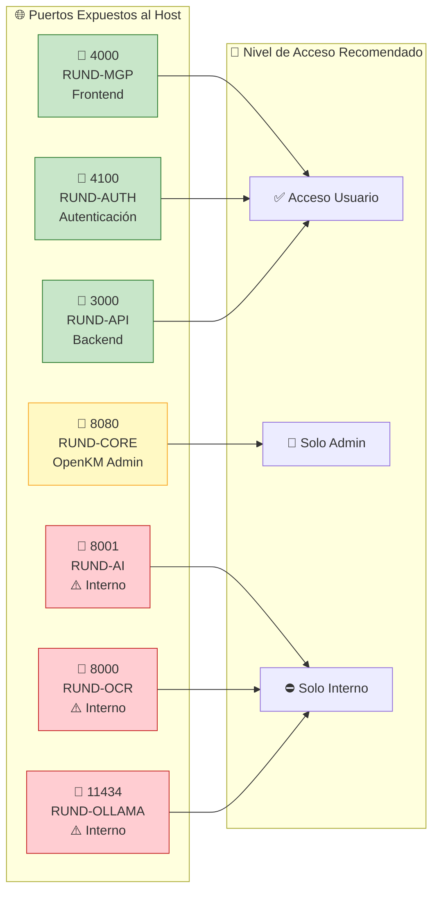

---

## 5. Diagrama de Flujo de Datos (DFD)

Este diagrama es fundamental para el análisis de amenazas (Threat Modeling).

### 5.1 DFD Nivel 0 - Contexto

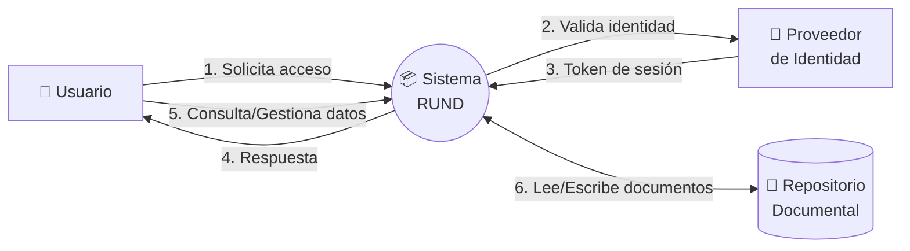

### 5.2 DFD Nivel 1 - Procesos Principales

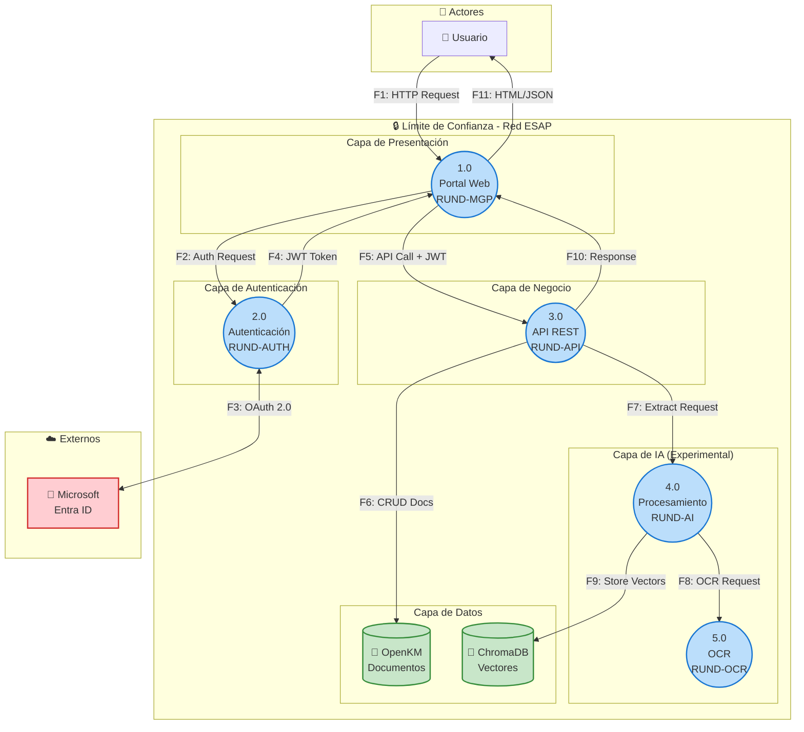

### 5.3 Flujos de Datos Detallados

| ID | Origen | Destino | Datos | Protocolo | Autenticación | Cifrado |
|----|--------|---------|-------|-----------|---------------|---------|
| F1 | Usuario | RUND-MGP | Peticiones HTTP, credenciales | HTTP | No (pendiente) | No (pendiente) |
| F2 | RUND-MGP | RUND-AUTH | Solicitud de token | HTTP | No | No |
| F3 | RUND-AUTH | Entra ID | Credenciales Microsoft | HTTPS | OAuth 2.0 | TLS 1.3 |
| F4 | RUND-AUTH | RUND-MGP | JWT Token | HTTP | N/A | No |
| F5 | RUND-MGP | RUND-API | Datos profesor, archivos | HTTP | JWT (pendiente) | No |
| F6 | RUND-API | RUND-CORE | Documentos, metadatos | HTTP | Basic Auth | No |
| F7 | RUND-API | RUND-AI | Documentos para procesar | HTTP | No | No |
| F8 | RUND-AI | RUND-OCR | Imágenes/PDFs | HTTP | No | No |
| F9 | RUND-AI | ChromaDB | Vectores de embeddings | Internal | No | No |
| F10 | RUND-API | RUND-MGP | Respuestas JSON | HTTP | No | No |
| F11 | RUND-MGP | Usuario | HTML, JSON, archivos | HTTP | No | No |

---

## 6. Flujo de Autenticación

### 6.1 Estado Actual (Sin Autenticación Implementada)

```mermaid
sequenceDiagram
    autonumber
    participant U as 👤 Usuario
    participant MGP as 🖥️ RUND-MGP
    participant API as ⚙️ RUND-API
    participant CORE as 📁 RUND-CORE

    Note over U,CORE: ⚠️ ESTADO ACTUAL: Sin autenticación

    U->>MGP: Accede al portal
    MGP->>API: GET /api/v2/profesores/{cedula}
    Note right of API: AuthMiddleware.authenticate()<br/>return true; // ⚠️ Bypass
    API->>CORE: GET /OpenKM/...<br/>Authorization: Basic okmAdmin:admin
    Note right of CORE: ⚠️ Credenciales hardcoded
    CORE-->>API: Datos del profesor
    API-->>MGP: JSON Response
    MGP-->>U: Muestra información

    Note over U,CORE: ❌ Cualquier usuario puede acceder a cualquier dato
```

### 6.2 Flujo Planificado (Con RUND-AUTH Integrado)

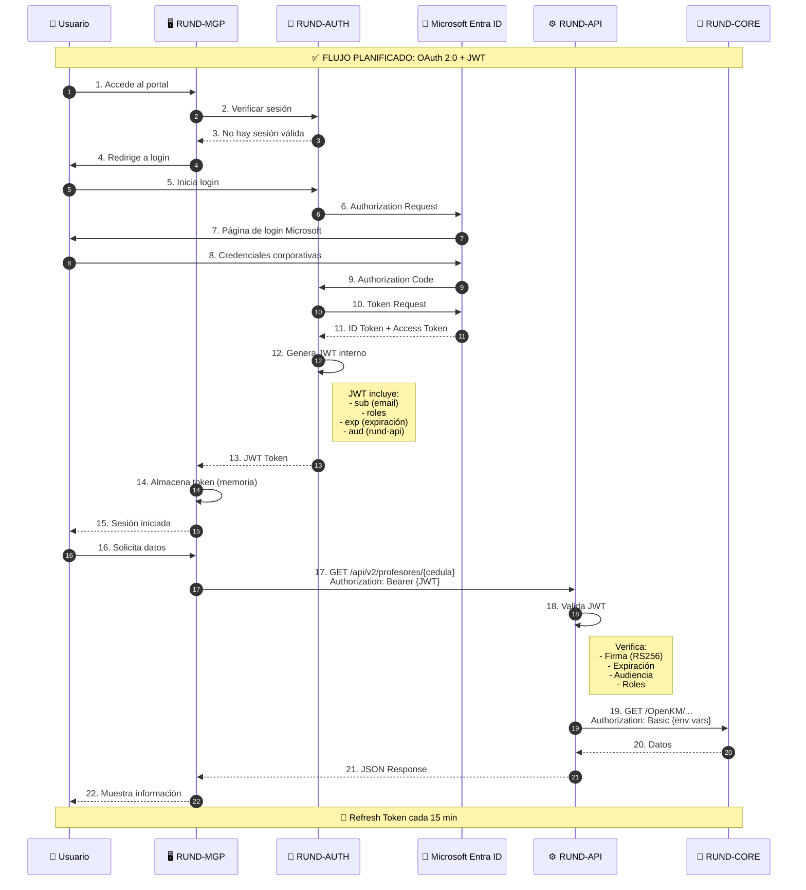

### 6.3 Estructura del JWT Planificado

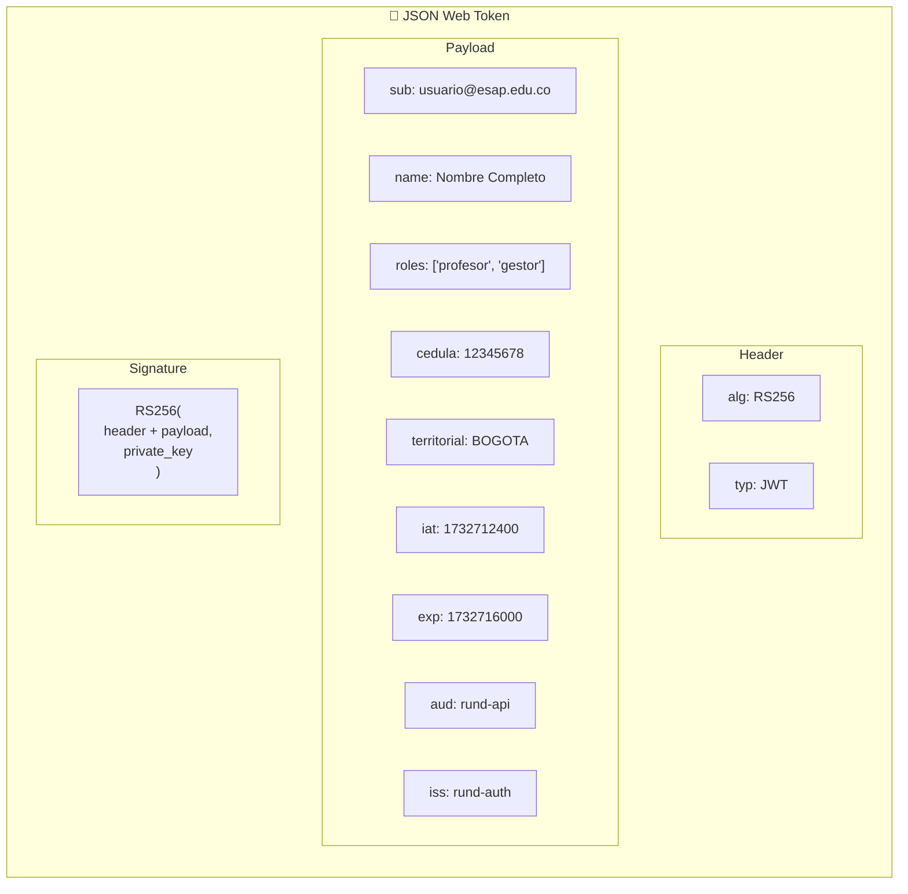

---

## 7. Matriz de Comunicaciones

### 7.1 Comunicaciones Internas (Red Docker)

| # | Origen | Destino | Puerto | Protocolo | Autenticación | Datos Transmitidos |
|---|--------|---------|--------|-----------|---------------|-------------------|
| 1 | rund-mgp | rund-api | 3000 | HTTP | JWT (pendiente) | Peticiones API, archivos |
| 2 | rund-mgp | rund-auth | 4100 | HTTP | N/A | Tokens, solicitudes auth |
| 3 | rund-api | rund-core | 8080 | HTTP | Basic Auth* | Documentos, metadatos |
| 4 | rund-api | rund-ai | 8001 | HTTP | No | Documentos para IA |
| 5 | rund-api | rund-ocr | 8000 | HTTP | No | Imágenes, PDFs |
| 6 | rund-api | rund-ollama | 11434 | HTTP | No | Prompts LLM |
| 7 | rund-ai | rund-ollama | 11434 | HTTP | No | Inferencia LLM |
| 8 | rund-ai | rund-ocr | 8000 | HTTP | No | Pipeline OCR |
| 9 | rund-ai | rund-api | 3000 | HTTP | No | Upload resultados |

*Credenciales actualmente hardcoded (a migrar a variables de entorno)

### 7.2 Comunicaciones Externas

| # | Origen | Destino | Puerto | Protocolo | Autenticación | Propósito |
|---|--------|---------|--------|-----------|---------------|-----------|
| 1 | Usuario | 172.16.234.52 | 4000 | HTTP | N/A (pendiente) | Acceso frontend |
| 2 | Usuario | 172.16.234.52 | 3000 | HTTP | N/A (pendiente) | API directa |
| 3 | rund-auth | login.microsoftonline.com | 443 | HTTPS | OAuth 2.0 | Autenticación |

### 7.3 Diagrama de Matriz de Comunicaciones

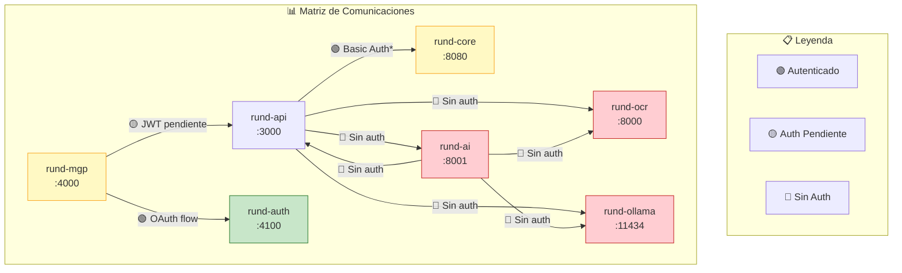

---

## 8. Inventario de Componentes

### 8.1 Componentes Funcionales

| Componente | Versión | Tecnología | Puerto | Imagen Docker | RAM | CPU |
|------------|---------|------------|--------|---------------|-----|-----|
| **RUND-CORE** | CE 6.3.x | OpenKM (Java/Tomcat) | 8080 | openkm/openkm-ce:latest | 2-3 GB | Bajo |
| **RUND-API** | 3.0 | PHP 8.3 + Apache | 3000 | ocastelblanco/rund-api:latest | 512 MB | Medio |
| **RUND-MGP** | 3.0 | Angular 20 + SSR | 4000 | ocastelblanco/rund-mgp:latest | 512 MB | Bajo |
| **RUND-AUTH** | 1.0 | Node.js 22 + Express | 4100 | En desarrollo | 256 MB | Bajo |

### 8.2 Componentes Experimentales

| Componente | Versión | Tecnología | Puerto | Imagen Docker | RAM | CPU |
|------------|---------|------------|--------|---------------|-----|-----|
| **RUND-AI** | 1.0 | Python 3.9 + Flask | 8001 | ocastelblanco/rund-ai:latest | 2 GB | Medio |
| **RUND-OCR** | 1.0 | Python 3.9 + PaddleOCR | 8000 | ocastelblanco/rund-ocr:latest | 1-2 GB | Alto |
| **RUND-OLLAMA** | Latest | Ollama Engine | 11434 | ollama/ollama:latest | 4-6 GB | Alto |

### 8.3 Volúmenes de Datos

| Volumen | Componente | Propósito | Tamaño Est. | Sensibilidad |
|---------|------------|-----------|-------------|--------------|
| openkm-data | RUND-CORE | Documentos y BD | 10-50 GB | **Alta** |
| ollama-data | RUND-OLLAMA | Modelos LLM | 6 GB | Baja |
| ai-models | RUND-AI | Embeddings | 500 MB | Baja |
| ai-cache | RUND-AI | ChromaDB | 1-2 GB | Media |
| ocr-temp | RUND-OCR | Temporales | 1 GB | Media |

---

## 9. Consideraciones de Seguridad

### 9.1 Estado Actual vs. Planificado

| Aspecto | Estado Actual | Estado Planificado | Prioridad |
|---------|---------------|-------------------|-----------|
| Autenticación usuarios | ❌ Sin implementar | ✅ OAuth 2.0 + JWT | **Crítica** |
| Autorización (RBAC) | ❌ Sin implementar | ✅ Roles en JWT | **Crítica** |
| Credenciales OpenKM | ⚠️ Hardcoded | ✅ Variables de entorno | **Crítica** |
| CORS | ⚠️ Abierto (*) | ✅ Lista blanca | **Alta** |
| TLS/HTTPS | ❌ HTTP plano | ✅ TLS en producción | **Alta** |
| Rate Limiting | ❌ Sin implementar | ✅ Por IP/usuario | Media |
| Headers de seguridad | ❌ Ausentes | ✅ CSP, HSTS, etc. | Media |
| Logging de auditoría | ⚠️ Básico | ✅ Completo con alertas | Media |

### 9.2 Vulnerabilidades Conocidas (Ambiente UAT)

| ID | Descripción | Severidad | Mitigación Planificada |
|----|-------------|-----------|------------------------|
| V1 | Credenciales OpenKM hardcoded | **Crítica** | Migrar a env vars |
| V2 | Sin autenticación en API | **Crítica** | Integrar RUND-AUTH |
| V3 | CORS permisivo | **Crítica** | Configurar whitelist |
| V4 | Servicios AI/OCR expuestos | **Alta** | Remover puertos públicos |
| V5 | Comunicación HTTP plano | **Alta** | Implementar TLS |

### 9.3 Notas para la Oficial de Seguridad

1. **Ambiente documentado:** Este documento refleja el ambiente UAT, no producción.
2. **Autenticación pendiente:** La integración con Microsoft Entra ID está pendiente de recibir credenciales de aplicación por parte de OTIC.
3. **Vulnerabilidades conocidas:** Las fallas V1 y V3 son temporales y serán corregidas antes del paso a producción.
4. **Componentes experimentales:** RUND-AI, RUND-OCR y RUND-OLLAMA no están destinados a producción en esta fase.
5. **Acceso restringido:** El servidor UAT solo es accesible desde la red interna de la ESAP o vía VPN.

---

## 10. Anexos

### Anexo A: Endpoints Críticos

| Endpoint | Método | Datos Sensibles | Nivel de Riesgo |
|----------|--------|-----------------|-----------------|
| `/api/v2/profesores/{cedula}` | GET | PII completo | **Crítico** |
| `/api/v2/profesores/{cedula}/archivos` | GET | Documentos privados | **Crítico** |
| `/api/v2/certificados/generar` | POST | Datos para certificados | **Alto** |
| `/api/v2/archivos/subir` | POST | Documentos | **Alto** |
| `/api/v2/archivos/{uuid}` | DELETE | N/A (destrucción) | **Crítico** |

### Anexo B: Variables de Entorno Requeridas

```bash
# RUND-API (a implementar)
OPENKM_HOST=rund-core
OPENKM_PORT=8080
OPENKM_USER=<rotativo>
OPENKM_PASS=<rotativo>
CORS_ALLOWED_ORIGINS=http://172.16.234.52:4000

# RUND-AUTH (a implementar)
AZURE_TENANT_ID=<pendiente-otic>
AZURE_CLIENT_ID=<pendiente-otic>
AZURE_CLIENT_SECRET=<pendiente-otic>
JWT_PRIVATE_KEY_PATH=/keys/private.pem
JWT_PUBLIC_KEY_PATH=/keys/public.pem
JWT_EXPIRATION=3600
```

### Anexo C: Checklist de Seguridad Pre-Producción

- [ ] Credenciales de OpenKM en variables de entorno
- [ ] RUND-AUTH integrado con Entra ID
- [ ] CORS configurado con whitelist
- [ ] Puertos de AI/OCR/Ollama no expuestos
- [ ] TLS/HTTPS habilitado
- [ ] Rate limiting implementado
- [ ] Headers de seguridad configurados
- [ ] Logging de auditoría completo
- [ ] Pruebas de penetración básicas realizadas

---

**Documento preparado por:**  
Dirección de Entornos y Servicios Virtuales (DESV)  
Escuela Superior de Administración Pública  

**Contacto técnico:**  
ocastelblanco@esap.edu.co

---

*Este documento contiene información confidencial de la ESAP. Su distribución está restringida al personal autorizado.*
